# ScalaDB

ScalaDB is a database application made for keeping track of your scala
quaranta games played.

Created by Peter Seabrook 

### Instructions and Help

To make executable:
```
Terminal: chmod +x main.py
```
Add '#!PATH_TO_PYTHON to top of the file
replacing PATH_TO_PYTHON to where you python is located on your system.

You can find this by typing 'which python' in terminal.

Dependencies of this app are:
```
SQLAlchemy==1.3.18
```

There are two ways to run the app:
```
./main.py
```
Or with flags:
```
./main.py --help
./main.py --addsub
./main.py --view
```

## Software Development Plan

### Application Purpose and Scope

This application was designed to keep pen off paper and keep the process of score keeping
digital and trackable. It also provides stats of all the players high scores and streaks.
This will be the basis of a future web application in flask based around the same principals.
### Features

**Easy UI**

The UI design is pretty straight forward used ascii art for a cool header to keep it retro.
The menu system is light with 5 options to choose from and will run in terminal with limited
screen real estate as well.
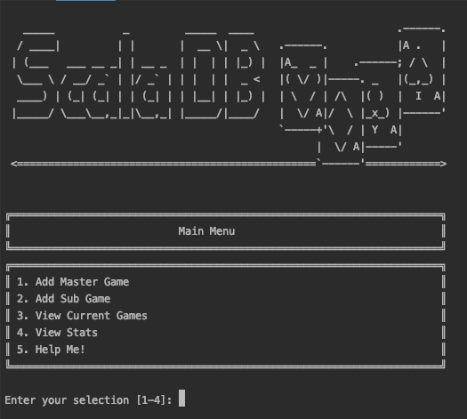

**Scalability & Deployability**

Using SQLAlchemy allows the end user or system admin to be able to translate the app to other cloud services
such as AWS, Docker or Kubernetes to name a few. It has the ability to be easily integrated into a web
application or an API service that can be called from a mobile app.

**SQL DB**

The app features a fully scalable and deployable SQL database which is compatible with MYSQL,
SQLite, Postgress for easy cloud integration for later upgrades or scalability.
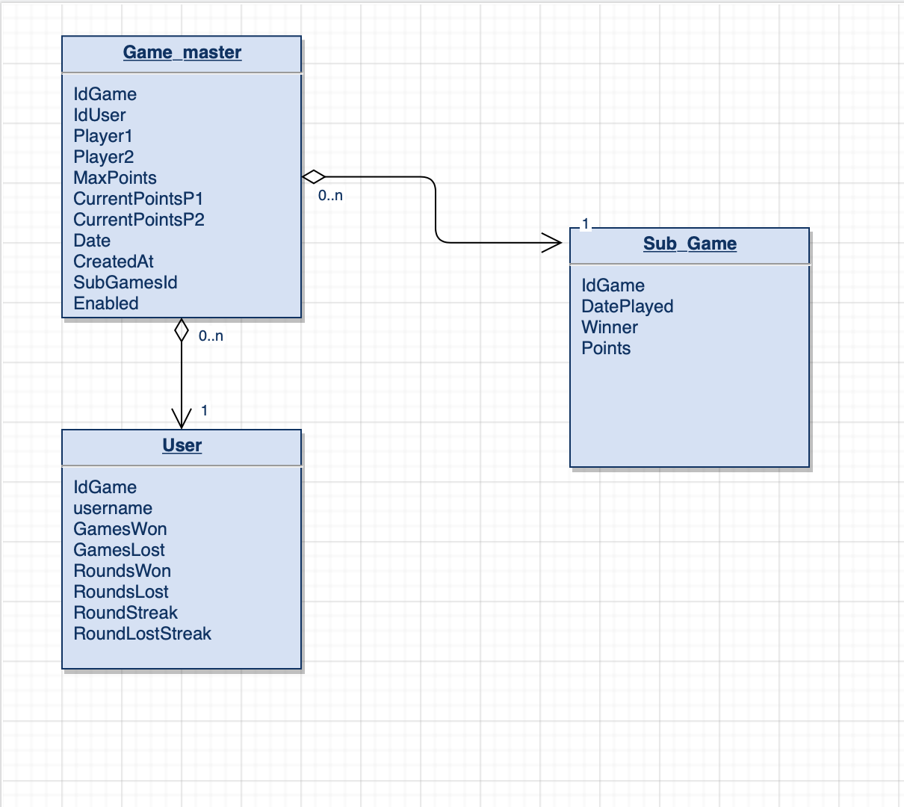

**Control Flow**
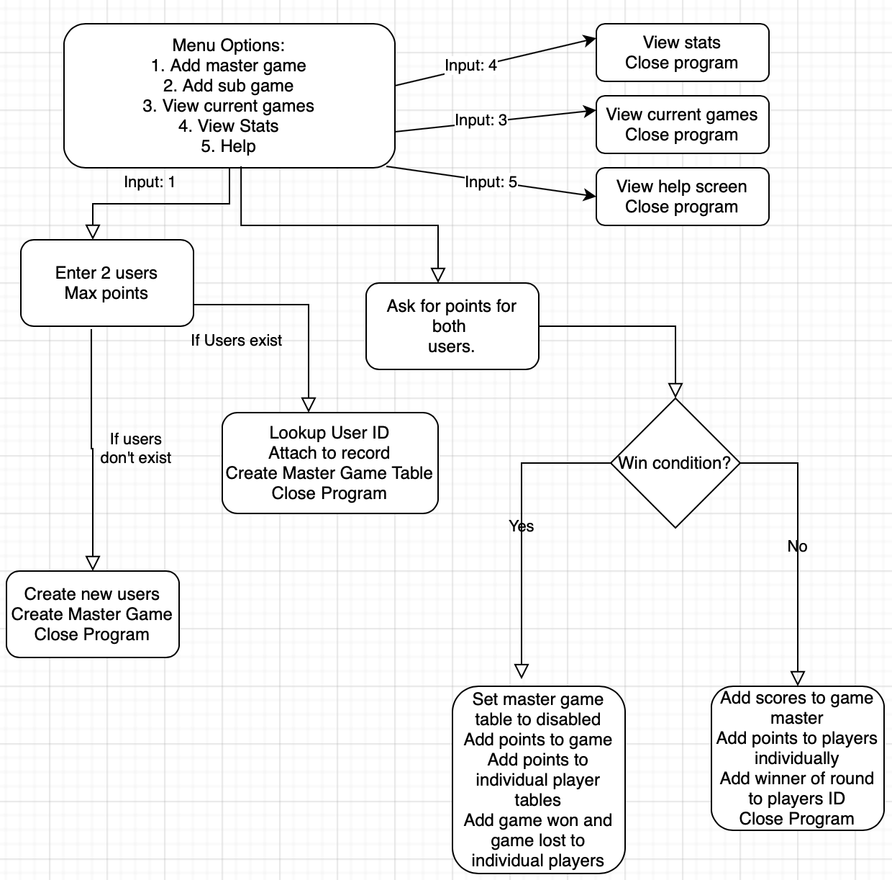

## User Interaction

Interaction is handled by the terminal in all cases.
The use can choose to runt he program fully or for ease of use sake they can run with terminal
flags to add games quickly once played so they don't have to waste time going through the menu again.

User's choose numbers to take them to whichever menu item they desire.
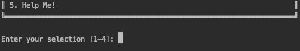

Adding Game a master game.
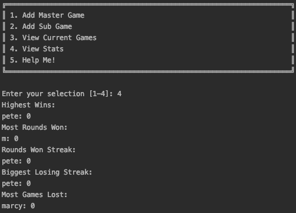

Adding a round to a master game, can be accessed with --addsub flag from terminal.
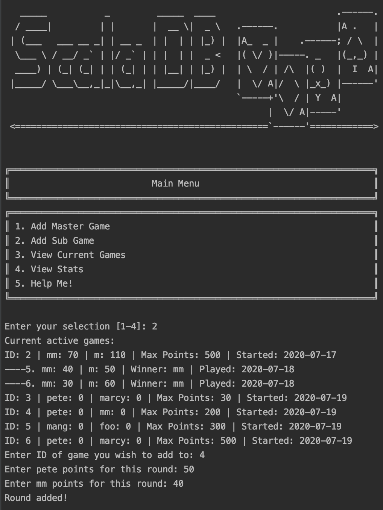

Game stats sub menu.


View current games in play, can also be accessed with --view flag from terminal.
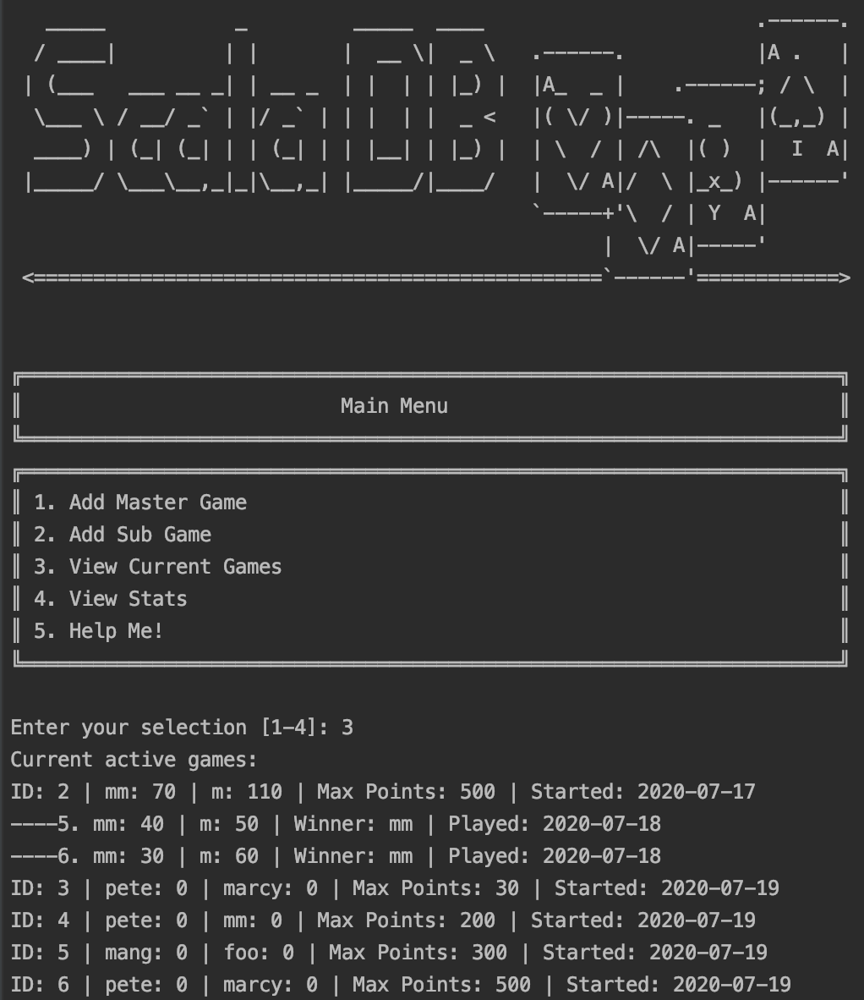

View help docs for the app, can be accessed with --help flag from terminal.
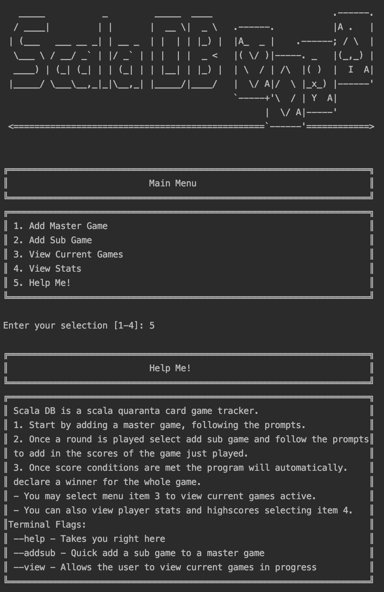

## Testing

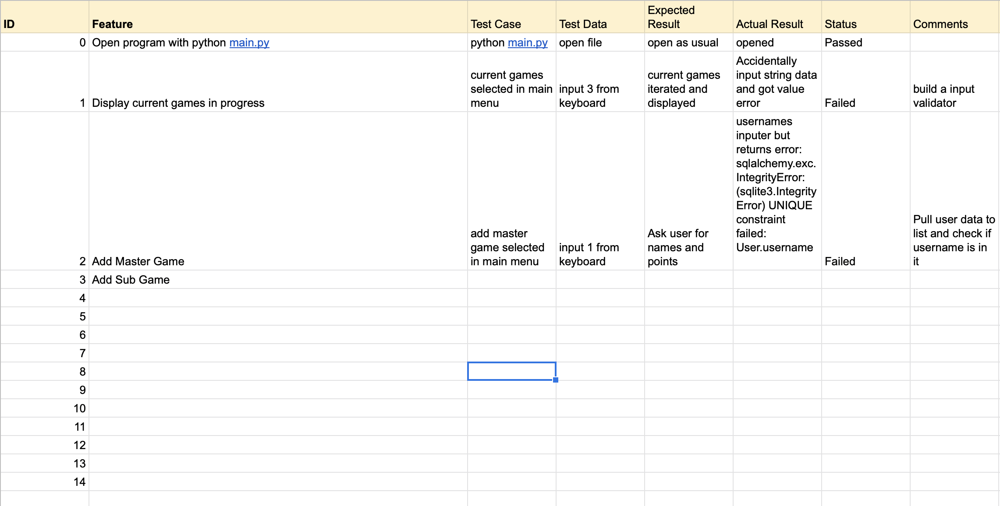
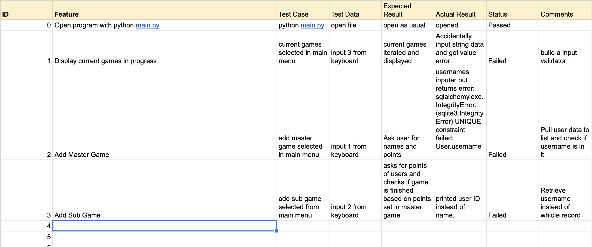
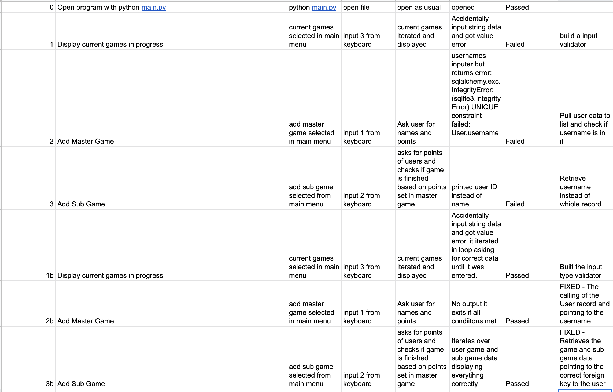

## Management
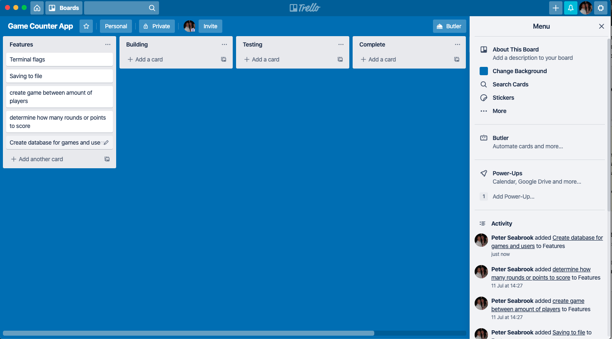
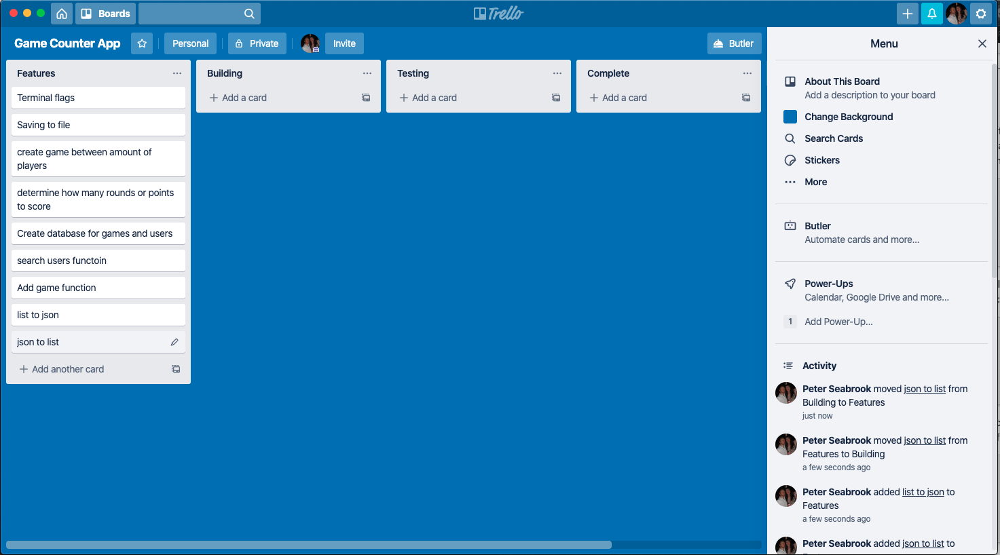

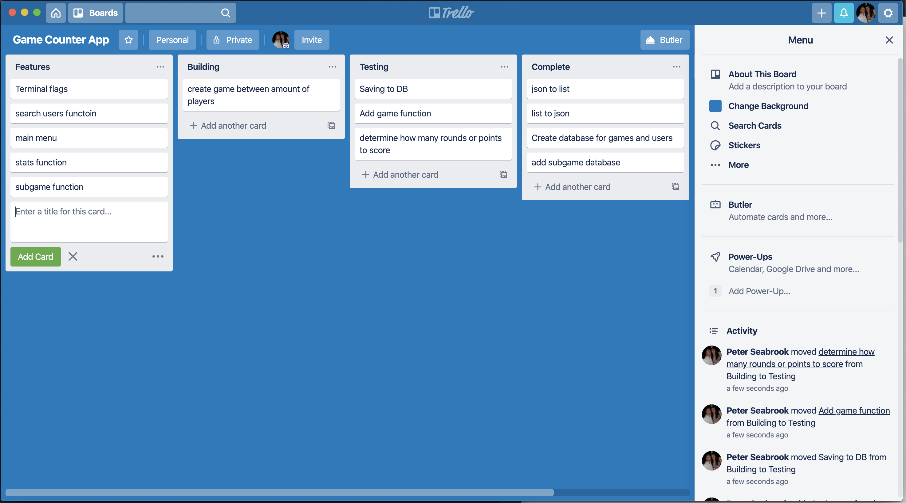
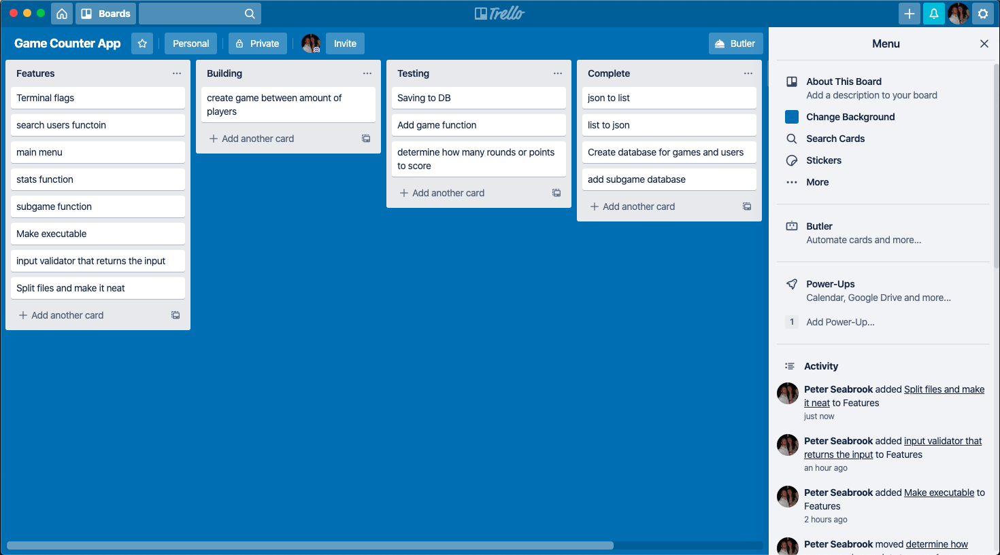